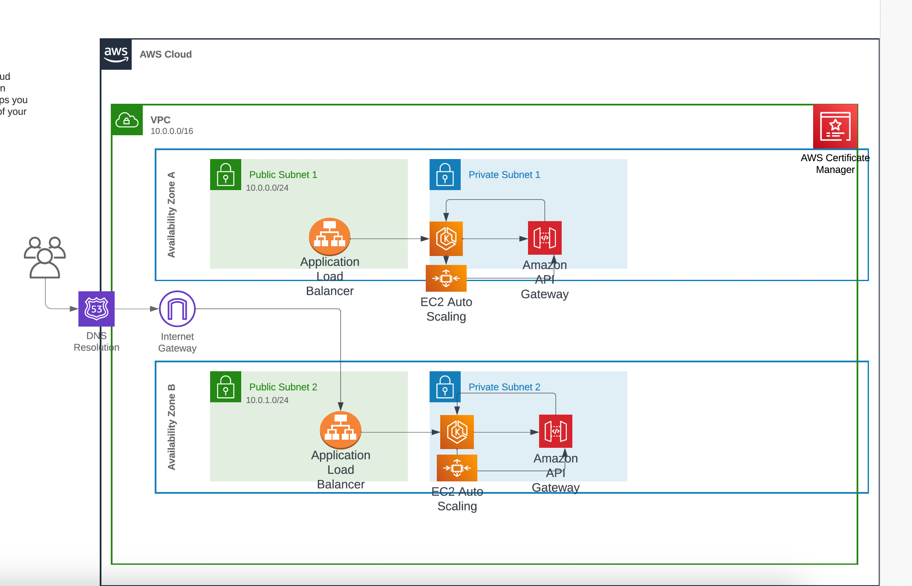

## Architechture for creating an AI app on AWS

## Resources needed to be created

### Networking

**VPC**

- Public subnet
- Private subnet
- Security group
- Internet Gateway
- Route tables

***Compute***

- Launch template
- Autoscaling group
- scaling policies
- EC2 instances

**EKS cluster**
- EKS cluster
- EKS Managed Node group
- EKS Node IAM Role
- ECR

**Objects**
- S3

